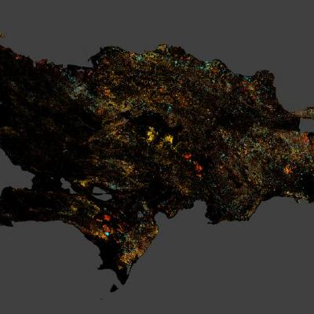

```{r, eval=FALSE, include=FALSE}
library(knitr)
library(kableExtra)
opts_chunk$set(
  echo = TRUE,
  warning = FALSE,
  message = FALSE,
  fig.pos = 'H'
)
source('R/funciones.R')
```


```{r setup, include=FALSE}
knitr::opts_chunk$set(
  cache = FALSE, 
  echo = TRUE,
  warning = FALSE,
  message = FALSE,
  out.width = '80%',
  dpi = 300,
  fig.align = "center"
  )
# options(digits = 3)
options(knitr.duplicate.label = "allow")
```


```{r pkgsetings, echo=F, include=F}
set.seed(99)
library(tidyverse)
theme_set(theme_bw()) 
library(kableExtra)
options(knitr.kable.NA = '', knitr.table.format = 'latex')
```

> Nota 1 del Tali: el uso de MAYÚSCULAS en esta plantilla, no significa "estoy gritando", sino una convención para indicarte dónde debes rellenar contenido. Tan pronto leas el mensaje escrito en mayúsculas, bórralo para que no quede en tu entrega.

> Nota 2 del Tali: pide ayuda a inteligencia artificial, y recuerda también usar el foro en caso de "tranque".

# Introducción

- ESCRIBE AQUÍ LA SECCIÓN "INTRODUCCIÓN".

- INCLUYE REFERENCIAS BIBLIOGRÁFICAS. LA SECCIÓN "INTRODUCCIÓN" ES UN BUEN LUGAR PARA ELLO. PARA CITAS DIRECTAS, USA @ETIQUETA_BIBTEX. INCLUYE LA CITA ENTRE CORCHETES, [@ETIQUETA_BIBTEX], SI QUIERES QUE, EN EL PDF TEJIDO, LA CITA APAREZCA "(AUTOR, AÑO)".

- INSERTA AQUÍ UNA FIGURA DE ARCHIVO (E.G. UN ÚNICO ARCHIVO, SÓLO UNO, QUE MUESTRE, AUNQUE SEA PARCIALMENTE, LO QUE ENTREGASTE EN LA PRÁCTICA 02. SI NO TIENES DICHO ARCHIVO, PUEDES USAR CUALQUIER OTRO ARCHIVO ALEGÓRICO AL TEMA O A LA PRÁCTICA).

# Materiales y métodos

- ESCRIBE AQUÍ LA SECCIÓN "MATERIALES Y MÉTODOS".

- INCLUYE REFERENCIAS BIBLIOGRÁFICAS. LA SECCIÓN "MATERIALES Y MÉTODOS" ES TAMBIÉN UN BUEN LUGAR PARA ELLO. PARA CITAS DIRECTAS, USA @ETIQUETA_BIBTEX. INCLUYE LA CITA ENTRE CORCHETES, [@ETIQUETA_BIBTEX], SI QUIERES QUE, EN EL PDF TEJIDO, LA CITA APAREZCA "(AUTOR, AÑO)".

- INSERTA FIGURAS, COMO MAPAS DE LOCALIZACIÓN O MOSTRANDO TU DEM.

- INCLUYE AQUÍ TABLAS DE DATOS DE FORMA ESTILIZADA, USANDO CÓDIGO DE R REPRODUCIBLE, COMANDO `knitr::kable` o `kableExtra::kable`, O DIRECTAMENTE EN MARKDOWN.

# Resultados

- ESCRIBE AQUÍ LA SECCIÓN "RESULTADOS".

- INSERTA FIGURAS, TABLAS GENERADAS CON `knitr::kable` o `kableExtra::kable`, O DIRECTAMENTE EN MARKDOWN.

- NO INSERTES RESULTADOS DE ANÁLISIS ESTADÍSTICOS TAL CUAL (POR EJEMPLO, NO PONGAS UNA CAPTURA DE PANTALLA DE R); LOS RESULTADOS DE ANÁLISIS ESTADÍSTICOS SE PRESENTAN COMO REDACCIÓN FLUIDA, O SI SON MUY DENSOS, EN FORMA DE TABLAS O GRÁFICOS.

# Discusión

- ESCRIBE AQUÍ LA SECCIÓN "DISCUSIÓN".

- SI LO DESEAS, INCLUYE AQUÍ REFERENCIAS BIBLIOGRÁFICAS. LA SECCIÓN "DISCUSIÓN" ES TAMBIÉN UN BUEN LUGAR PARA ELLO. PARA CITAS DIRECTAS, USA @ETIQUETA_BIBTEX. INCLUYE LA CITA ENTRE CORCHETES, [@ETIQUETA_BIBTEX], SI QUIERES QUE, EN EL PDF TEJIDO, LA CITA APAREZCA "(AUTOR, AÑO)".


# Nota sobre las referencias cruzadas (ELIMINA ESTA SECCIÓN CUANDO HAYAS GENERADO TU DOCUMENTO)

## Poner título y usar referencias cruzadas para tablas generadas con `kableExtra`

El bloque de código debería comenzar con ````{r tablaejemplokable, echo=FALSE}````, donde ````{r tablaejemplokable}```` sería la etiqueta para hacer la referencia cruzada. Nota que se debería usar también `echo=FALSE`, para que el código no se imprima, y sólo salga la tabla tras el tejido. Así se vería el código y la tabla saldría justo después:

```{r tablaejemplokable}
library(tidyverse)
library(kableExtra)
kable(
  x = mtcars[1:5, 1:5],
  caption = "Título de la tabla de ejemplo generada con kableExtra",
  booktabs = TRUE) %>%
  kable_styling(latex_options = "HOLD_position") %>%
  footnote(general = "Esta es una nota de una tabla generada con kableExtra.")
```

La referencia cruzada se debe escribir así "Ver tabla `\ref{tab:tablaejemplokable}`", y cuando el documento se teja, quedaría algo tal que esto "Ver tabla \ref{tab:tablaejemplokable}".


## Poner título y usar referencias cruzadas para tablas generadas manualmente usando sintaxis Markdown

La tabla que usa la sintaxis Markdown se escribe como se muestra abajo. Nota que el título está justo debajo, precedido de la palabra clave con dos puntos `Table:` y, al final aparece "`\label`":


\begin{Verbatim}[samepage=true]
| Columna 1 | Columna 2 | Columna 3 |
|-----------|------------|-----------|
| dato 1    | dato 2     | dato 3    |
| dato 4    | dato 5     | dato 6    |
Table:Título de la tabla de ejemplo generada manualmente.\label{tab:tablaejemplomanualmente}
\end{Verbatim}

Una vez tejido el documento, la referencia se vería así "Ver tabla \ref{tab:tablaejemplomanualmente}", y la tabla se representaría así con su correspondiente título:

| Columna 1 | Columna 2 | Columna 3 |
|-----------|------------|-----------|
| dato 1    | dato 2     | dato 3    |
| dato 4    | dato 5     | dato 6    |
Table:Título de la tabla de ejemplo generada manualmente.\label{tab:tablaejemplomanualmente}

## Poner título y usar referencias cruzadas para figuras insertadas manualmente

Para insertar una figura manualmente (el archivo debe estar disponible en la ruta donde es llamado, en este caso, en el directorio raíz del repo), es necesario hacero usando la sintaxis apropiada mostrada abajo.

\begin{Verbatim}[samepage=true]

\label{fig:figuramanual}
\end{Verbatim}

La sintaxis para insertar la referencia cruzada sería ésta: `Ver Fig. \ref{fig:figuramanual}`.

Luego del tejido, la referencia cruzada se vería así "Ver Fig. \ref{fig:figuramanual}" y la figura propiamiente se vería así:


\label{fig:figuramanual}


## Poner título y usar referencias cruzadas para figuras insertadas a partir de código de R

El bloque de código debería comenzar con ```{r figuraconcodigo, fig.cap="Esta es una figura generada con código", fig.width=0.5, fig.align='center', echo=FALSE, fig.pos='!H'}```, donde la primer parte ```{r figuraconcodigo}``` sería la etiqueta para hacer la referencia cruzada. Nota que se debería usar también `echo=FALSE`, para que el código no se imprima, y sólo salga la figura tras el tejido, y para que quede en posición, se usa `fig.pos='!H'`. También se usa `fig.cap=""` para definir el título de la figura, y otras opciones adicionales. Así se debería escribir el código y la figura saldría justo después:


```{r figuraconcodigo, fig.cap="Esta es una figura generada con código", out.width='50%', fig.align='center', fig.pos='H'}
plot(cars)
```

La referencia cruzada se debe escribir así "Ver Fig. `\ref{fig:figuraconcodigo}`", y cuando el documento se teja, quedaría algo tal que esto "Ver Fig. \ref{fig:figuraconcodigo}".


# Referencias {.unnumbered}
